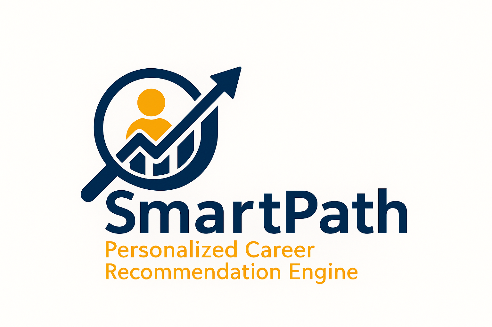

# SmartPath Career Recommender Engine
Empowering informed career decisions through intelligent, data-driven recommendations.

<p align="center">
  
</p>

**Discover careers aligned with your strengths, passions, and education.** 
 Powered by RIASEC Science and real-world job market data.

## Overview
SmartPath is an intelligent career recommender system designed to guide students, graduates, and job seekers toward ideal career paths aligned with their interests, skills, education and preferences. 

Built using machine learning and interactive visualizations, this tool empowers learners and job seekers to make informed, personalized data-driven career decisions.

Unlike generic career portals, SmartPath uses a hybrid similarity model to deliver actionable, custom-fit job recommendations, helping users identify their best-fit occupations and the skills they need to thrive.

---

## Core Features

Collects user input for:
- RIASEC interest scores (Realistic, Investigative, Artistic, Social, Enterprising, Conventional)
- Educational attainment
- Self-identified strong skills

Computes:
- Cosine similarity between user interests and occupational profiles
- Skill match scores based on user strengths
- Education compatibility

Outputs:
- Top 10 personalized career matches
- Skills match and education alignment
- CSV export + optional email delivery
- Summary visualization of recommendations

---

## Data Sources
SmartPath leverages curated occupational data from reliable public resources to ensure accuracy and relevance in career recommendations.  

| Dataset                    | Description                                                     | Source                                                                           |
| -------------------------- | --------------------------------------------------------------- | -------------------------------------------------------------------------------- |
| **O\*NET 27.0 Database**   | Occupational profiles with skills, RIASEC scores, and education | [O\*NET Database](https://www.onetcenter.org/database.html)                      |
| **Interests Data**         | RIASEC distributions per job                                    | [O\*NET Interests](https://www.onetonline.org/find/descriptor/result/4.A.1.a.1)  |
| **Skills Importance**      | Importance ratings for 35+ skills per job                       | [O\*NET Skills](https://www.onetonline.org/skills/)                              |
| **Education Requirements** | Mapped typical education levels per occupation                  | [O\*NET Education](https://www.onetonline.org/find/descriptor/browse/Education/) |

The datasets were cleaned, transformed, and combined into a unified job profile format (job_profiles_clean.csv) used for real-time matching.

Cleaned data sample: `./data/job_profiles_clean.csv`

---

## Tech Stack

- Python
- Pandas & NumPy
- Scikit-learn
- Streamlit
- Cosine Similarity (for recommender logic)

---
## Models & Recommendation Logic
The core of SmartPath is a **hybrid similarity model** that blends statistical scoring and machine learning to ensure highly personalized career recommendations.

- **Cosine Similarity**  
  Measures the angle between the user's RIASEC vector and each occupation's interest vector from O\*NET. Returns values from -1 (opposite) to 1 (perfect match).

- **Filtered Hybrid Similarity Score**  
  A final weighted score combining:  
  - RIASEC Cosine Similarity  
  - Skill Match Ratio (overlap of top 3 user skills vs. job-required skills)  
  - Education Level Compatibility (0 = mismatch, 1 = partial match, 2 = full match)

> These scores form the ranking backbone of our Top 10 career suggestions.

---

### Unsupervised Learning (Career Group Discovery)

Unsupervised learning was applied to find patterns and cluster jobs in the feature space. This supports **recommendation diversification** and enhances insight explainability.

- **KMeans Clustering** - Primary clustering algorithm for grouping jobs based on combined skill and interest profiles  
- **Agglomerative Clustering** - Built job similarity dendrograms for hierarchy understanding  
- **DBSCAN** - Identified niche job segments and outliers  
- **HDBSCAN** - Dynamic, noise-aware clustering for highly granular career paths

---

### Supervised Learning (Classification & Prediction)

Supervised ML was used to predict likely job clusters or roles based on labeled user profiles, improving the model's ability to validate and reinforce recommendations.

- **Logistic Regression** - Fast probabilistic classifier for early testing  
- **Random Forest** - Robust tree-based model for job path prediction  
- **XGBoost** - High-performing, interpretable model trained on cleaned and engineered user-job interaction data

---

## How It Works

1. **User Input**  
   - RIASEC scores (6-dim), top 3 skills, education level

2. **Similarity Engine**  
   - Cosine Similarity (RIASEC), Skill Match, Education Check

3. **Scoring & Filtering**  
   - Education filter applied, weighted score calculated

4. **Results Output**  
   - Top 10 job matches, skill/education gaps, CSV export, email option

---

 ## Deployment (SmartPath App)
This project is deployed and accessible live via Streamlit Cloud.

**[SmartPath Personalized Career Recommender](https://smartpath.streamlit.app/)** 

**[SmartPath Personalized Career Recommender](https://allan-ofula.streamlit.app/)**

Explore the app, get your recommended career paths, and interact with insightful dashboards instantly!

## Running the SmartPath App Locally
Follow the steps below to run SmartPath locally:

1. Clone this Repository
```bash
git clone https://github.com/Allan-Ofula/SmartPath-Personalized-Career-Recommendation-Engine.git
cd SmartPath-Personalized-Career-Recommendation-Engine
```

2. **Install dependencies**:

```bash
pip install -r requirements.txt
```

3. **Launch the Streamlit app**:

```bash
streamlit run app.py
```

4. **Access the app**:

Visit `http://localhost:8501` in your browser.

---

## Project Structure

```
SmartPath/
├── app.py
├── recommender_engine.py
├── data/
│   └── job_profiles_clean.csv
├── utils/
├── requirements.txt
└── README.md
```
## Features

- Hybrid Recommendation System using RIASEC + Skills + Education
- Tailored for the African job market
- Interactive Streamlit dashboard for user input and insights
- Recommender logic based on cosine similarity hybrid
- Clean and modular code structure

 ## Additions

**1. User Feedback System**
- Emoji/text-based feedback stored in feedback.csv
- Optional feedback analytics dashboard
- Future Slack/email alerts for admin

**2. Admin Dashboard**
- Trends in user input, top jobs recommended
- Feedback summary via Streamlit charts

---

## Future Improvements

- Resume parsing for auto-input
- Personalized career roadmap prediction
- Geo-localized job relevance
- Full user authentication (Streamlit + Firestore)
- Advanced skill gap analysis using embeddings

---

## Acknowledgments
We would like to express our sincere gratitude to:

- Moringa School – for mentorship, learning foundation and project framework.
- O*NET (Occupational Information Network) – for the rich job dataset that powers this recommendation engine.
- Career Development Theorists – especially John Holland (RIASEC model)

Special thanks to our mentors and instructors:
   - Mildred Jepkosgei 
   - Brian Chacha
   - Antony Muiko

This work reflects a growing commitment to applying data science in empowering youth, career clarity, and digital transformation in Africa.

---

## Authors

**Rachael Nyawira**  
Kenya | Data Science Learner | Passionate about using data to transform lives  
[Email](rachaelnyawira614@gmail.com) |
[GitHub](https://github.com/rachael-coder) | [LinkedIn](https://www.linkedin.com/in/yourlinkedin/)

**Beryl Okelo**  
Kenya | Data Science Learner | Passionate about using data to transform lives  
[Email](okelloakoth@gmail.com) |
[GitHub](https://github.com/BAOKELO) | [LinkedIn](https://www.linkedin.com/in/berylokelo)

**Beth Nyambura**  
Kenya | Data Science Learner | Passionate about using data to transform lives  
[Email](lizshiru11@gmail.com) |
[GitHub](https://github.com/betty254809) | [LinkedIn](https://www.linkedin.com/in/beth-nyambura-b3964b234/)

**Allan Ofula**  
Kenya | Data Scientist | Youth Advocate | Developer of SmartPath | Passionate about using data to transform lives  
[Email](ofulaallan@gmail.com) |
[GitHub](https://github.com/Allan-Ofula) | [LinkedIn](https://www.linkedin.com/in/allan-ofula-b2804911b/)

**Eugene Maina**  
Kenya | Data Science Learner | Passionate about using data to transform lives  
[Email](eugenemaina72@gmail.com) | [GitHub](https://github.com/eugene-maina72) | [LinkedIn](https://www.linkedin.com/in/yourlinkedin/)

---

## Final Note
*"SmartPath isn't just a project, it's a mission to democratize data-driven career guidance for youth across Africa and beyond. Powered by Data Science, AI, and open data, we're unlocking opportunities and building futures, one youth at a time."*

## Contact
Feel free to reach out or contribute ideas to improve the engine for greater impact!
